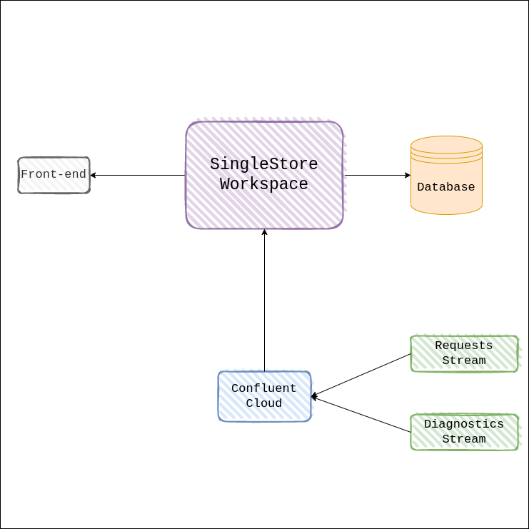

  

# Router Holmes

The project implements a Realtime Analytics dashboard for hypothetical company which is in-charge of managing routers in New York City. It simulates the routers, its status and individual people across the city and displays the data in a realtime-updated dashboard with useful visualizations.

## Architecture

  

## Tech Stack

- React
- Typescript
- NextJS
- SingleStoreDB
- deck.gl

## Repository Structure

The repository is structured as follows:

- `public`: Contains the logo and favicon for the project
- `pages`: Next pages directory, contains api routes and main pages.
- `components`: Contains all the components used in the project.
- 'data' : Contains simulator to create data, along with the results of the simulation
- Other configuration files

## Data Simulator
Contains the jupyter notebook for data simulation.
There are 4 files:
- `router.csv`: Not streaming data, represents the routers and their location in the city.
- `people.csv`: Not streaming data, represents the mapping between a persons's ID and their name.
- `diagnostics.csv`: Streaming data, contains the diagnostic details sent by each router at each timestep.
- `request.csv`: Streaming data, contains the requests sent by each person to the router/city that they are currently in.

To stream the simulation, you can use any kafka producer, we have used a producer that streams it to confluent. The producer files are also in the `data` directory. To stream the data to confluent please refer [here](https://github.com/mtpatter/time-series-kafka-demo).

In short, after setting up the docker image from the above repo, you have to execute 
``docker run -it --rm \
      -v $PWD:/home \
      --network=host \
      kafkacsv python <path to producer> <topic name>``

## Getting Started

1. Setup SinglestoreDB with Docker
2. Copy `sql/people.csv` and `sql/routers.csv` to the `/` directory of the docker container
3. Setup Confluent cloud and replace the placeholders in `sql/creation.sql` file with your own url and secret. Also create appropriate topics for the pipelines i.e. `diagnostics` and `request`
3. In the local web interface, run the commands found in `sql/creation.sql`. This will create a database, tables and pipelines for those tables.
4. Install necessary dependencies with `yarn`
5. Start the dashboard with `yarn dev`
6. Start the data simulator (instructions above) and see the analytics update in real time!!
